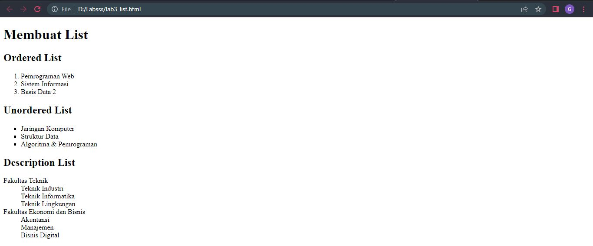

# Lab3Web
Praktikum3

# LIST
## Membuat Dokumen HTML List
Ini adalah tampilannya

## Membuat Ordered List
Menambahkan kode untuk membuat Ordered List '
'
Ini adalah tampilannya

## Membuat Unorderd List
Menambahkan kode untuk membuat Unordered List '
'
Ini adalah tampilannya

## Membuat Description List
Menabahkan kode untuk membuat description list '
'
Ini adalah tampilannya

# TABLE
## Membuat Dokumen HTML Tabel
Ini adalah tampilannya

## Membuat Tabel dan Mengatur Margin dan Padding
Untuk mengatur margin dan padding pada cel data, tambahkan atribut cellpadding dan
cellspacing pada tag table
Ini adalah tampilannya

## Menggabungkan Sel Data
Untuk menggabungkan sel data, gunakan atribut rowspan dan colspan.
Ini adalah tampilannya

# FORM
## Membuat Dokumen HTML Form
Ini adalah tampilannya

## Menambahkan kode untuk membuat tabel sederhana
Ini adalah tampilannya

## Menabahkan Style pada Form
Style pada form menggunakan CSS
Ini adalah tampilannya
